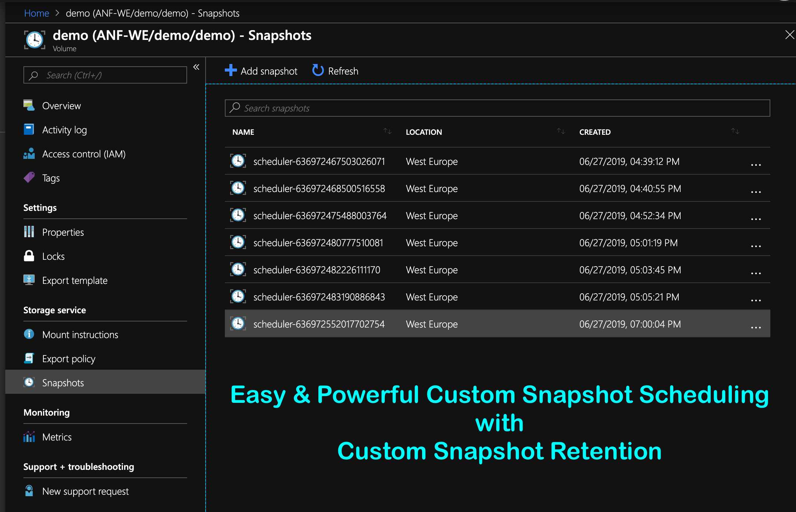
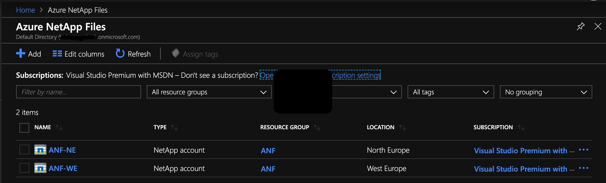
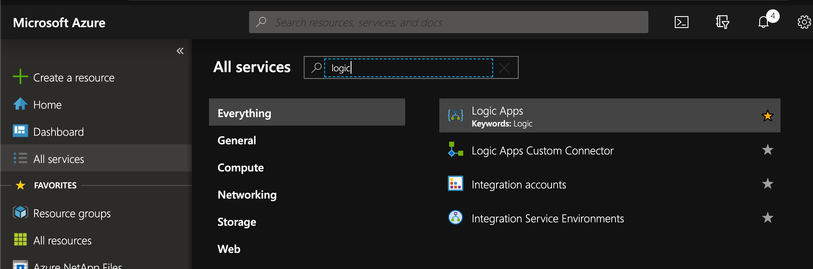

# Azure NetApp Files Snapshot Scheduler
Created by Kirk Ryan - @kirk__ryan / kirk.ryan@netapp.com

A simple to use Azure NetApp Files scheduler built upon Azure Logic Apps

## Introduction
This Azure Netapp Files snapshot scheduler allows you to take snapshots at any supported interval i.e. daily, hourly. etc and automatically manages snapshot retention for the specified number of snapshots.

## Installation & Configuration
### Installation
Please download the zip file from this repository. It contains the ARM template in order to deploy ANF Scheduler to your environment. The deployment can be run with deploy.ps1 or deploy.sh.

### Configuration
Once you have installed the template you must configure the anfScheduler logic app to be able to access your Azure NetApp Files resources. Please note, that anfScheduler has no access to your data and operates entirely at the management API level.

You will need the following information about the volume for which you would like to schedule snapshots for:

 1. Subscription ID - The Azure Subscription ID containing your ANF services
 2. NetApp Account - The name of your Azure NetApp Files account that you provision your capacity pools and volumes within. 
 3. Resource Group - The resource group name your ANF volume is deployed within
 4. Capacity Pool - The capacity pool name your ANF volume is deployed within
 5. Volume Name - The name of the volume you would like ANF Scheduler to manage snapshot creation and retention for.
 6. Retention - The amount of snapshots you would like to retain

Once you have the above information to hand you will need to populate those values into the logic app as so:

1. If you haven't already, open the logic app in your Azure Portal by chosing "All Services -> Logic Apps" 
2. 
