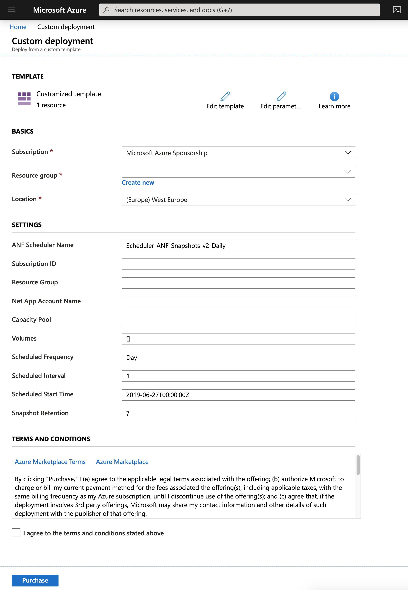
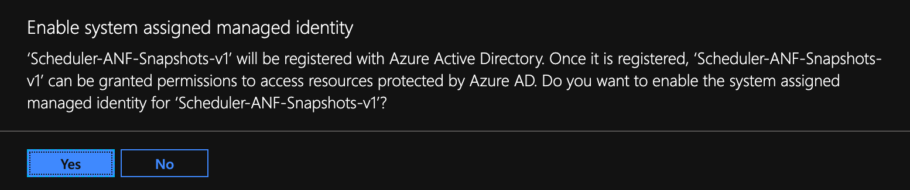
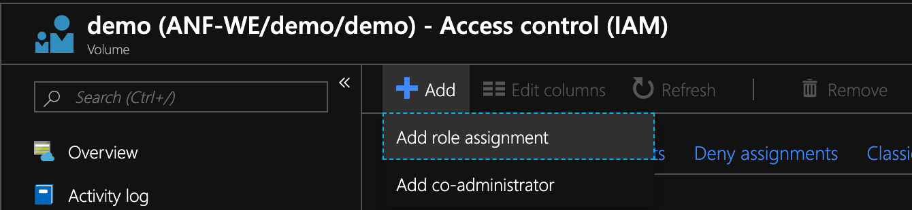
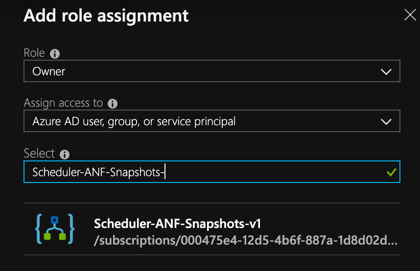

# Azure NetApp Files Snapshot Scheduler
Created by Kirk Ryan - [@kirk__ryan](https://twitter.com/kirk__ryan)

A simple to use Azure NetApp Files snapshot scheduler built upon Azure Logic Apps

## Change Log
2.0 - Add support for multiple volumes & scoping (a scheduler will only act upon it's own snapshots)
1.0 - Support for single volume per scheduler

## Introduction
This Azure Netapp Files snapshot scheduler allows you to take snapshots at any supported interval i.e. daily, hourly. etc and automatically manages snapshot retention for the specified number of snapshots.

## Philosophy of operation
The scheduler will create snapshots at the interval and frequency that you specify in the configuration. When the retention limit is reached, the scheduler will remove the oldest snapshot on that volume. Each logic app will act only upon snapshots it generates within its defined scope, therefore it is possible to have multiple logic app schedulers (i.e. one for hourly, one for daily, one for weekly) and they will not conflict with one another.

## Installation & Configuration
### Installation

Deployment couldn't be simpler - simply click the button below to deploy the logic app into your environment:

### Configuration
Once you lauch the template above, you **must** configure the anfScheduler logic app to be able to access your Azure NetApp Files resources. Please note, that anfScheduler has **no access to your data** and operates entirely at the management API level.

You will be presented with the following deploymeny prompt:

You will need the following information about the volume for which you would like to schedule snapshots for:

 1. ANF Scheduler Name - The name of the scheduler to deploy. It is recommened to follow the Scheduler-ANF-Snapshots-v2- followed by your custom naming such as daily/hourly/etc
 2. Subscription ID - The Azure Subscription ID containing your ANF services (i.e. f3a13d61-d1d9-4f12-b2j3-1baa96w7e1bc)
 3. NetApp Account - The name of your Azure NetApp Files account that you provision your capacity pools and volumes within
 4. Resource Group - The resource group name your ANF volume is deployed within
 5. Capacity Pool - The capacity pool name your ANF volume is deployed within
 6. Volumes - The list of volume(s) you would like ANF Scheduler to manage snapshot creation and retention for. **This must be an array** i.e. ["volname1", "volname2"]
 7. Scheduled Frequency - How often you want to run the scheduler (i.e. one of the following: Month, Week, Day, Hour, Minute)
 8. Scheduled Interval - How often to run the interval
 9. Retention - The amount of snapshots you would like to retain

## Assigning Permissions to the ANF scheduler

#### Step 1 : Configure the logic app managed identity
Once you have the above information to hand you will need to populate those values into the logic app as follows:

1. If you haven't already, open the logic app in your Azure Portal by chosing "All Services -> Logic Apps" 
2. Select the Scheduler-ANF-Snapshots-v*x*
3. Enable system assigned identity - this allows you to control the access ANF Scheduler has to your Azure NetApp Files resources right down to a single volume (granular!) 
4. Select Yes when prompted and note the name of your identity 

#### Step 2: Assign the Managed Identity access to Azure NetApp Files
1. Select the capacity pool or volume you would like to allow access to for the managed identity.
2. Select Access Control (IAM) and select "Add" then "Add Role Assignment"
3. Next select "Owner" as role, 
4. Assign access to "Azure AD user, group of service principal"
5. Select your managed identity: 
6. That's it, the ANF scheduler now has the correct permissions to create and delete snapshots for your given volume.

### Troubleshooting

Here are some known errors you may encounter commonly caused by misconfiguration

#### WorkflowManagedServiceIdentityNotSpecified. The workflow 'Scheduler-ANF-Snapshots-v2' does not have managed service identity enabled. See [https://aka.ms/logicapps-msi](https://aka.ms/logicapps-msi) for details.
Answer: You have not enabled the managed identity in Step 2. Please enable and try again

#### The term "Login-AzureRmAccount is not recognized".....
Answer: You are using PowerShell module > 2.0.69 i.e. 2.4.0. Use the deploy-AzModule.ps1 instead of deploy.ps1.

#### Connect-AzAccount : Access to the path '/Users/yourusername/.Azure/AzureRmContext.json' is denied.
Answer: You do not have sufficient user priviliges on your client. Restart PowerShell as admin (windows) or sudo (linux/unix/macOS) and try again.
