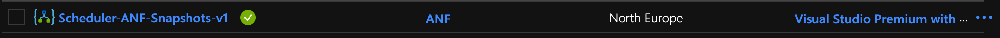
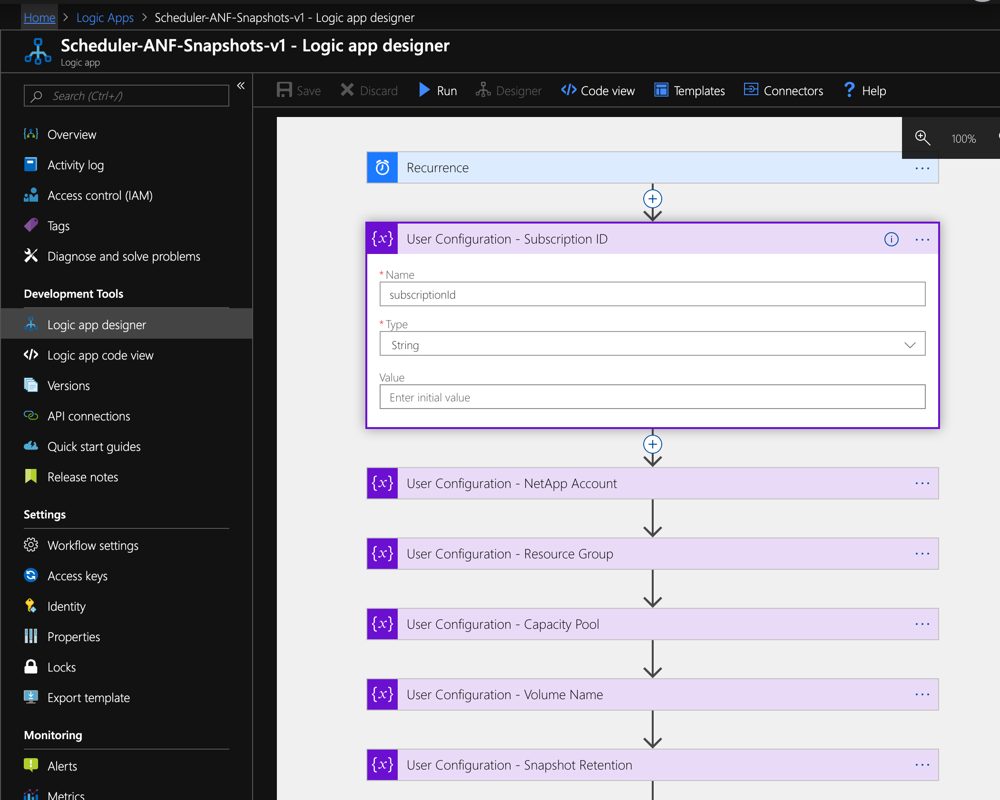
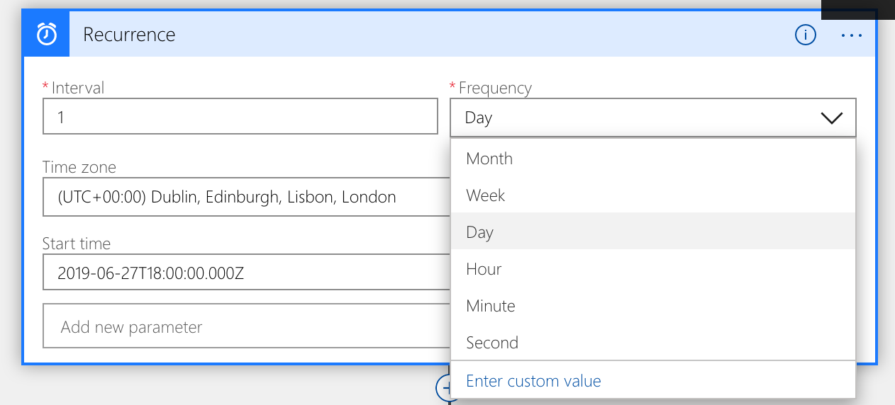

# Azure NetApp Files Snapshot Scheduler
Created by Kirk Ryan - @kirk__ryan / kirk.ryan@netapp.com

A simple to use Azure NetApp Files snapshot scheduler built upon Azure Logic Apps

## Introduction
This Azure Netapp Files snapshot scheduler allows you to take snapshots at any supported interval i.e. daily, hourly. etc and automatically manages snapshot retention for the specified number of snapshots.

## Installation & Configuration
### Installation
Please download the zip file from this repository. It contains the ARM template in order to deploy ANF Scheduler to your environment. The deployment can be run with deploy.ps1 or deploy.sh.

### Configuration
Once you have installed the template you **must** configure the anfScheduler logic app to be able to access your Azure NetApp Files resources. Please note, that anfScheduler has **no access to your data** and operates entirely at the management API level.

You will need the following information about the volume for which you would like to schedule snapshots for:

 1. Subscription ID - The Azure Subscription ID containing your ANF services
 2. NetApp Account - The name of your Azure NetApp Files account that you provision your capacity pools and volumes within. 
 3. Resource Group - The resource group name your ANF volume is deployed within
 4. Capacity Pool - The capacity pool name your ANF volume is deployed within
 5. Volume Name - The name of the volume you would like ANF Scheduler to manage snapshot creation and retention for.
 6. Retention - The amount of snapshots you would like to retain

#### Step 1 : Configure the logic app managed identity
Once you have the above information to hand you will need to populate those values into the logic app as follows:

1. If you haven't already, open the logic app in your Azure Portal by chosing "All Services -> Logic Apps" 
2. Select the Scheduler-ANF-Snapshots-v*x*
3. Enable system assigned identity - this allows you to control the access ANF Scheduler has to your Azure NetApp Files resources right down to a single volume (granular!) 
4. Select Yes when prompted and note the name of your identity 

#### Step 2: Assign the Managed Identity access to Azure NetApp Files
1. Select the capacity pool or volume you would like to allow access to for the managed identity.
2. Select Access Control (IAM) and select "Add" then "Add Role Assignment"
3. Next select "Owner" as role, 
4. Assign access to "Azure AD user, group of service principal"
5. Select your managed identity: 
6. That's it, the ANF scheduler now has the correct permissions to create and delete snapshots for your given volume.

#### Step 3: Customise the Logic App to your ANF environment
1. Navigate back to your logic app and click the "designer" button on the top bar - you will now need to enter your specific environmental variables such as resource group, volume name, etc. To do so, simply each User Configuration heading (purple) and enter your values into the value field 
2. Remain on this page, you'll need it for the next and final step

#### Step 4: Set your schedule and retention
1. By default the logic app is configured to take a daily snapshot and retain 7 days before removing the oldest snapshot. If you would like to configure any of the parameters simple select the recurrance heading (blue) and configure appropriately. For example a daily would be 1 interval on a daily frequency. You can select the time the job will run easily. 
2. Finally, you must configure your retention. For example, if you would like to keep the last 7 days and your schedule was set to an interval of 1 with frequency of daily, then set the User Configuration: Snapshot Retention to 7. Likewise if you were taking hourly snapshots and wanted the last 48 hours, then set User Configuration: Snapshot Retention to 48. 

### Troubleshooting

Here are some known errors you may encounter commonly caused by misconfiguration

#### WorkflowManagedServiceIdentityNotSpecified. The workflow 'Scheduler-ANF-Snapshots-v1' does not have managed service identity enabled. See [https://aka.ms/logicapps-msi](https://aka.ms/logicapps-msi) for details.
Answer: You have not enabled the managed identity in Step 2. Please enable and try again
